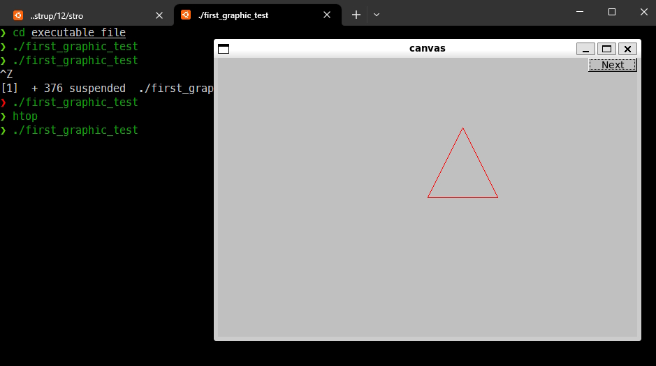

# This my old easy fixed for fltk v1.3.8 / For book - B. Stroustrup Principles and Practice Using C++ (2nd Edition)
**`Tested in WSL2 Ubuntu 20.04`**

Source Code - https://github.com/BjarneStroustrup/Programming-_Principles_and_Practice_Using_Cpp

## But how? Easy instruction:
1. Install WSL2 and Ubuntu(cli enough).
2. Set you Ubuntu:
Open a shell and install some software:
```
  sudo apt-get install g++ or sudo apt-get install clang
  sudo apt-get install gdb
  sudo apt-get install git
  sudo apt-get install autoconf
  sudo apt-get install libx11-dev
  sudo apt-get install libglu1-mesa-dev
```
  These two are optional, but highly recommended:
```
  sudo apt-get install libasound2-dev
  sudo apt-get install libxft-dev
```
3. Download fltk v1.3.8 - https://www.fltk.org/software.php and unpack in user folder Ubuntu
4. in folder fltk-1.3.8
execute commands one by one:
```
   sudo sh configure
```
> [!Tip]
> if the previous command doesn't work try one of these: `sudo bash configure`;  `sudo zsh configure`; `chmod +x configure`
```
   make
```
```
   test/demo - if yo want to test
```
```
   sudo make install
```
```
   sudo apt install libfltk1.3-dev
```
6. delete folder fltk-1.3.8
7. clone this git or download .zip
command to compile:
```
clang++ -Wall -g first_example.cpp Graph.cpp GUI.cpp Simple_window.cpp Window.cpp `fltk-config --ldflags --use-images` -lfltk -o ~/_you_path_/first_graphic_test
```
or
```
g++ -Wall -g first_example.cpp Graph.cpp GUI.cpp Simple_window.cpp Window.cpp `fltk-config --ldflags --use-images` -lfltk -o ~/_you_path_/first_graphic_test
```
necessarily flags: `fltk-config --ldflags --use-images` -lfltk

**Good luck!**
---

What the files? I don't remember anymore, but let them be xD


